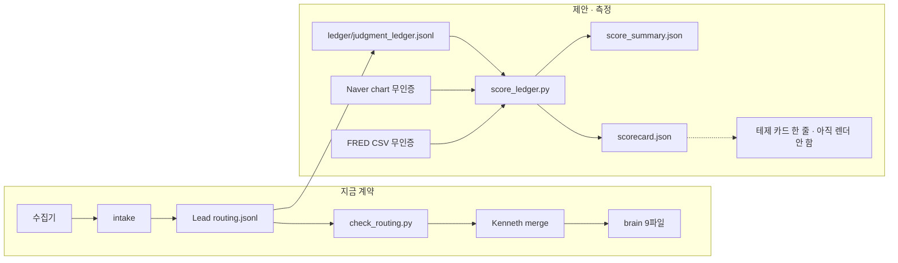

# 판단 장부 — 설계 (2026-10-08)

형식은 `check_routing.py` 가 막는다. 결과가 맞았는지는 아무도 나중에 보지 않는다. 하루에 routing 이 수십 줄이고, 같은 실적을 채널 여섯 곳이 다시 올리면 확인이 여러 번으로 센다. 이 문서는 그 빈칸 — 스탠스를 기록하고, 만기 후에 벤치마크 대비로 채점하는 층 — 의 설계와, 2026-10-08 라우팅으로 만든 작은 표본이다.

Jump 식 루프(가설 → 백테스트 → 표본 밖 / 다중검정 → 결합, 마지막은 사람)와 비교하면 우리는 아직 **결과 검증과 다중검정 보정**이 없다. 이번 스캐폴드는 결과 검증의 자리만 만든다. 적중률은 부호이고, Bonferroni 나 deflated Sharpe 는 넣지 않았다.

## 루프



채점기는 brain 을 고치지 않는다. 카드 HTML 도 고치지 않는다. `scorecard.json` 을 나중에 `render_cards.py` 가 읽으면 페이지가 바뀐다. 그 연결은 Kenneth 가 경고 문장을 승인한 다음이다.

## 파일을 어디에 두나

세 후보를 버렸다.

| 후보 | 왜 아닌가 |
|---|---|
| `routing.jsonl` 에 필드 추가 | 줄은 append-only 다. 채점은 나중에 같은 줄을 고친다. `check_routing.py` 의 `KNOWN_FIELDS` 밖 필드는 경고이고 다음 버전에서 거절이다. `disposition` · `theses_change` · `portfolio_change` 는 넣지 않는다. |
| `brain/` 열 번째 파일 | `brain/README.md` 와 `AGENTS.md` §6. 브레인은 판단의 정본 9개다. 장부는 판단이 아니라 판단의 채점이다. |
| `intake/files/**/*ledger*.jsonl` | 2026-09-27 광통신 원장. `check_routing.py` 가 `brain_rid` 없는 그 경로를 거절한다. `files/` 는 원문 조각이다. |

그래서 측정 층은 저장소 루트의 `ledger/` 다. 모든 행의 `routing_id` 는 `brain/routing.jsonl` 에 있어야 하고, 스탠스 문장은 여기 있어도 테제를 움직이지 않는다. 이 디렉터리는 §6 「새 저장소」와 충돌한다. `AGENTS.md` §9 는 **제안**으로만 적혀 있고 `check_routing.py` 는 보지 않는다. 예외를 승인하지 않으면 이 커밋을 되돌리면 된다.

스탠스 필드(`stance` · `ref` · `breaks_if` · `evidence`)는 백필 스크립트가 한 번 쓴 뒤 고치지 않는 것이 원칙이다. 채점기가 쓰는 칸은 `scores` 뿐이다. 미국 장중이라 기준가가 직전 세션인 행은, 공식 종가가 나온 뒤 `ref` 를 덮어쓰지 않는다. 개정은 아직 없고, 열린 질문에 두었다.

## 스키마

정본 설명은 `ledger/schema.json`. 한 행은 라우팅 하나가 아니라 **(routing id, 티커)** 하나다. `r-20261008-40` 은 삼성 긍정 · 하이닉스 부정으로 두 행이다.

방향은 `긍정` · `중립` · `부정` · `헤지` 만이다. 수량 · 비중 · 스톱 · 주문 필드는 `scripts/check_ledger.py` 가 거절한다.

```json
{
  "id": "j-20261008-01",
  "routing_id": "r-20261008-10",
  "date": "2026-10-08",
  "ticker": "005930",
  "market": "KR",
  "stance": "긍정",
  "stance_source": "backfill-inferred",
  "score_mode": "excess",
  "instrument": "equity",
  "lead": "tg-20261008-093704",
  "pages": ["hbm-packaging/hbm_pkg_company_samsung.html#T1"],
  "claim_ko": "한국어 한 줄",
  "ref": {
    "price": 263000.0,
    "currency": "KRW",
    "asof": "2026-10-08",
    "session": "regular-close",
    "naver_code": "005930",
    "endpoint": "https://api.stock.naver.com/chart/domestic/item/005930/day"
  },
  "benchmark": {"symbol": "KOSPI", "price": 6625.93, "asof": "2026-10-08"},
  "horizons": ["30d", "90d"],
  "breaks_if": [{
    "text": "10/29 콜에서 HBM4 QoQ 3배 가이던스가 미달이면 메모리 해석이 깨진다.",
    "metric": "hbm4_qoq_guide", "op": "lt", "threshold": 3, "unit": "x",
    "deadline": "2026-10-29", "check": "manual"
  }],
  "evidence": {"intake_n": 6, "independent_n": 1},
  "scores": null
}
```

`check` 는 셋이다.

- `manual` — 콜 · 공시 · 계약처럼 시세 시계열이 없는 조건. 채점기는 상태를 `manual` 로 남긴다.
- `price` — 그 티커(또는 벤치마크)의 종가와 `op` · `threshold` 를 비교한다.
- `macro` — `metric` 이 `fred:DGS10` 처럼 FRED 시리즈일 때만. 키 없는 `fredgraph.csv`.

`score_mode: manual` 은 주식이 아닌 상품이다. 이번 표본의 스페이스X 행은 5년 CDS 이고, 네이버에 `SPCX.O` 주가가 있어도 초과수익으로 맞다/틀리다를 적지 않는다.

## 가격

시세 봇과 수집기가 이미 쓰는 호스트만 쓴다. 시크릿 없다. 야후는 쓰지 않는다 — `collect_sources.py` 가 짧은 시간에 429 를 낸다고 적어 두었다.

| 시장 | 종목 | 벤치마크 | 엔드포인트 |
|---|---|---|---|
| KR | `domestic/item/{코드6}` | KOSPI `domestic/index/KOSPI` | `api.stock.naver.com/chart/...` |
| US | `foreign/item/{로이터코드}` | SPY `foreign/item/SPY` | 같은 호스트. 코드는 `update_prices.py` 의 `AVGO.O` · `ORCL.K` 관례 |
| JP | `foreign/item/6762.T` | 니케이 225 `.N225` | 종목 경로의 `.N225` 는 빈 배열이었다. `chart/foreign/index/.N225/day` 와 `api.stock.naver.com/index/.N225/basic` 의 `indexName` = 니케이 225 |

기준가는 **그 달력일의 정규장이 끝난 뒤의 종가**다. 타임존은 `Asia/Seoul` 15:30, `Asia/Tokyo` 15:30(네이버 TYO `endTime`), `America/New_York` 16:00. 2026-10-08 백필 시각에 미국 정규장은 열려 있었다. 당일 바의 `closePrice` 는 마지막 체결이라 `ref` 에 넣지 않고 `same_day_bar_ignored.used: false` 로만 남겼다. 미국 네 행의 기준일은 2026-10-07 이다. 조기 폐장은 아직 구분하지 않는다.

섹터 ETF 는 기본이 아니다. `SMH.O` 는 `update_prices.py` 의 `WATCH_US_ETF` 에 이미 있다. 스탠스가 반도체 베타일 때만 벤치마크를 바꿀 수 있고, 이번 표본의 브로드컴 · 오라클 행은 신용 이전이라 SPY 를 썼다.

숫자를 받지 못하면 `price` 는 null 이고 `unverified_reason` 에 호스트와 경로를 남긴다. 이 표본에서는 열세 행 모두 종가가 왔다.

## 채점

`python3 scripts/score_ledger.py` (저장소 루트).

기산일은 `ref.asof` 다. 30일 · 90일 달력일이 오기 전에는 `status: pending` 이고 수익률을 만들지 않는다. 만기 후에는 그 날짜 이전 마지막 완료 종가로

- 종목 수익률 = 만기 종가 / 기준가 − 1
- 벤치마크 수익률 = 같은 구간의 벤치마크
- 초과수익 = 둘의 차

판정은 부호다. 밴드는 0 이다.

| 스탠스 | 만기 판정 |
|---|---|
| 긍정 | 초과수익 > 0 이면 hit, 아니면 miss. 0 은 miss |
| 부정 | 초과수익 < 0 이면 hit, 아니면 miss |
| 중립 | `no-call`. 초과수익은 남기되 적중률 분모에 넣지 않는다 |
| 헤지 · `score_mode: manual` | `manual`. 적중률 분모 밖 |

`check: price|macro` 조건이 `fired` 이면, 이미 계산된 호라이즌 판정을 `invalidated` 로 바꾼다. 돈이 맞아도 깨기로 한 조건이 깨진 것이다. 이번 표본의 조건은 전부 `manual` 이라 이 분기는 테스트에서만 돈다.

`ledger/score_summary.json` 은 스탠스별 · `lead` 별 · `page#T` 별 개수와 적중률(`hit / (hit+miss)`, 분모 0 이면 null)이다. `lead` 는 routing 의 `source` 다. 오늘은 사람 이름이 아니라 배치 id 이거나 `t.me/...` 다.

적중률은 **행** 기준이다. 기판 노트 한 줄이 대덕 · 심텍 · 해성 세 행이면 페이지 집계도 세 번이다. 다중검정 보정은 없다.

## 출처를 하나로 세기

`scripts/source_cluster.py`. 한 routing 의 `intake[]` 안에서만 묶는다.

1. `t.me` · `cutt.ly` · `vo.la` 같은 배포·단축 호스트는 출처가 아니다.
2. 같은 외부 URL, 또는 같은 DART `rcpNo` 는 하나다. `rcpNo` 를 경로에서 지우면 모든 공시가 한 문서가 되므로 쿼리를 남긴다.
3. 50조 이상 금액이 두 개 이상 겹치면(0.6조 허용, `억` 은 1조 = 10,000억 으로 환산) 같은 실적 인쇄다. 숫자가 하나뿐인 짧은 재게시(「삼성전자 영업이익 107조」)는 같은 이름이고 더 긴 인쇄의 숫자와 0.6조 안이면 붙인다.
4. 분석 노트가 인쇄 숫자 하나와 자기 숫자 여러 개를 같이 가지면 두 번째 출처다. 부분집합이라고 삼키지 않는다.
5. 행과 행 사이의 연결은 URL · `rcpNo` 만이다. 숫자 지문은 행 밖으로 나가지 않는다.

2026-10-08 `r-20261008-10` 은 intake 6건, 채널 6곳(aether · insidertracking · Samsung_Global_AI_SW · YeouidoStory2 · meritz · beluga)이고 독립 출처는 1건이다. 키는 `dart.fss.or.kr/.../?rcpNo=20261008800004`. `r-20261008-11` 은 텔레그램 헤드라인과 한경 URL 이 1건이다. `r-20261008-15` 는 2건으로 남았다 — CDS 150/190bp 와 블루오리진 100억/280억은 같은 라우팅에 적혀 있지만 같은 기사가 아니다.

## 테제 스코어카드와 priced_in 경고

`ledger/scorecard.json` 은 `brain/theses.json` 의 `log[]` 를 읽기만 한다.

- 확인 = 마크에 `ⓐ` 가 있고 `ⓑ` 가 없는 줄
- 반박 = 마크에 `ⓑ`
- 연속 확인 = 로그 끝에서 `ⓐ` 만 이어진 길이. 다른 마크가 나오면 멈춘다
- `priced_in 경고` = 그 길이가 5 이상. 문턱은 제안이다

2026-10-08 채점 기준 경고 12건. 긴 쪽은 메모리 사이클 T1 · AI 밸류체인 T4 (각 11), 광통신 T2 (10), 기판 T2 (8). 장부 표본의 호라이즌은 아직 안 왔으므로 이 경고는 **과거 ⓐ 연속**이지 이번 스탠스의 적중이 아니다.

카드에 넣을 문장(아직 `render_cards.py` 에 없음):

> 확인 11 · 반박 0 · 연속 ⓐ 11 · priced_in 경고. breaks_if manual 0 · fired 0.

경고가 난 테제만, 그리고 장부가 가리키는 `page#T` 만 파일에 넣는다. 테제 400개의 전수 덤프는 아니다.

## 2026-10-08 백필

`python3 scripts/backfill_ledger_sample.py` 가 routing 13줄을 골라 열세 행을 썼다. `stance_source` 는 전부 `backfill-inferred` 다. Lead 가 그날 방향을 적어 둔 것이 아니다. 방향은 variant 의 읽기이고, 확정 공시가 아닌 문장은 중립이다.

| id | routing | 티커 | 방향 | 기준가 | 기준일 | 벤치마크 | 독립 출처 |
|---|---|---|---|---|---|---|---|
| j-01 | r-10 | 005930 삼성전자 | 긍정 | 263,000 KRW | 10-08 | KOSPI 6,625.93 | 1/6 |
| j-02 | r-11 | 005930 | 중립 | 263,000 | 10-08 | KOSPI | 1/2 |
| j-03 | r-12 | 000660 SK하이닉스 | 중립 | 1,686,000 | 10-08 | KOSPI | 1/1 |
| j-04 | r-14 | AVGO.O 브로드컴 | 부정 | 376.51 USD | 10-07 | SPY 777.22 | 1/1 |
| j-05 | r-14 | ORCL.K 오라클 | 부정 | 143.56 USD | 10-07 | SPY | 1/1 |
| j-06 | r-15 | SPCX.O 스페이스X | 부정 · CDS | 167.60 USD (참고) | 10-07 | 채점 안 함 | 2/2 |
| j-07 | r-16 | APLD.O | 긍정 | 23.81 USD | 10-07 | SPY | 1/1 |
| j-08 | r-20 | 353200 대덕전자 | 긍정 | 157,600 KRW | 10-08 | KOSPI | 1/1 |
| j-09 | r-20 | 222800 심텍 | 긍정 | 170,700 | 10-08 | KOSPI | 1/1 |
| j-10 | r-20 | 195870 해성디에스 | 긍정 | 65,600 | 10-08 | KOSPI | 1/1 |
| j-11 | r-40 | 005930 | 긍정 | 263,000 | 10-08 | KOSPI | 1/1 |
| j-12 | r-40 | 000660 | 부정 | 1,686,000 | 10-08 | KOSPI | 1/1 |
| j-13 | r-42 | 6762.T TDK | 중립 | 3,353 JPY | 10-08 | 니케이 225 69,042.11 | 1/1 |

종가 출처는 각 행의 `ref.endpoint`. 이름은 `name_on_naver` 가 아카이브 이름과 같았다(삼성전자, SK하이닉스, 브로드컴, 오라클, 스페이스X, 어플라이드 디지털, 대덕전자, 심텍, 해성디에스, TDK). 니케이 이름은 index basic, 코스피 이름은 `m.stock.naver.com/api/index/KOSPI/basic` 의 `stockName`. `api.stock.naver.com/index/KOSPI/basic` 은 409 였다.

넣지 않은 줄: `r-13` · `r-18` · `r-30` 은 레짐이고 종목 방향이 없다. `r-17` 은 기판 ASP 테마이고, 라우팅이 닛토보 · 미쓰이 카드를 만들지 않았다. 고객사 티커에 긍정/부정을 붙이지 않았다.

`score_ledger.py` 를 돌리면 30일 칸 13개가 모두 `pending` 이다. 부정 4개 중 CDS 1개는 요약에서 `manual` 이다. 적중률은 null 이다.

## AGENTS.md 에 넣은 제안

적용본은 `AGENTS.md` §9 이고, 아래와 같다. §1–§8 의 검사 조건은 그대로다.

```diff
+## 9. 판단 장부 — 제안 (2026-10-08 · Kenneth 리뷰 전 · 검사기는 아직 안 본다)
+
+이 절은 계약이 아니다. check_routing.py 는 이 절을 읽지 않는다.
+장부 행이 없는 기존 routing 줄은 유효하다.
+ledger/ 는 brain 10번째 파일이 아니다. §6 새 저장소 금지와 충돌하므로 예외를 요청한다.
+
+거래되는 이름에 방향이 있으면 ledger/judgment_ledger.jsonl 에 티커당 한 행.
+routing 에 필드를 더하지 않는다. 수량·비중·스톱 금지.
+기준가는 네이버 완료 종가. 불가면 null 과 endpoint.
+breaks_if 는 한국어 + 가능하면 metric/op/threshold/deadline/check.
+30일·90일 채점은 scripts/score_ledger.py. Lead 가 적중을 미리 적지 않는다.
+재게시는 scripts/source_cluster.py 가 독립 출처 1로 센다.
```

전문은 파일의 §9 가 정본이다. 이 diff 는 그 절의 요지다.

## 워크플로

`.github/workflows/score-ledger.yml` 은 `workflow_dispatch` 와, `ledger/` · 채점 스크립트가 바뀐 pull request 에서만 돈다. 스케줄이 없고 `contents: read` 라 main 에 커밋하지 않는다. 요약 JSON 은 artifact `judgment-ledger-score` 로만 남는다.

## 열린 질문

1. `ledger/` 를 §6 의 예외로 승인할지. 승인한다면 `check_ledger.py` 를 훅과 `brain-check.yml` 에 넣을지, 아니면 제안으로 남길지.
2. 중립을 계속 분모 밖으로 둘지. 초과수익이 큰 중립은 miss(방향을 빼먹은 것)로 볼지.
3. hit 를 초과수익의 부호로 두는 것. 거래비용 · 환 · 밴드 · 다중검정을 넣을지. 0 을 miss 로 둔 것.
4. 미국 당일 공식 종가가 나온 뒤 기준가를 어디에 붙일지. 지금은 직전 완료 종가만 있고, `ref` 개정 리스트는 없다.
5. 반도체 베타 스탠스에 `SMH.O` 또는 `.SOX` 를 SPY 대신 쓰는 규칙.
6. 연속 ⓐ 5 를 경고 문턱으로 둘지, 그 문장을 카드에 렌더할지.
7. 한 라우팅의 여러 티커(기판 3사)를 적중률에서 1건으로 묶을지.
8. CDS · 신용 조건의 무료 시계열. FRED 매크로는 `check: macro` 로 연결해 두었고, 스페이스X CDS 는 없다.
9. 앞으로의 스탠스를 Lead 가 행에 직접 쓸지. 이번 열세 행은 백필 추론이라, 나중에 적중률이 나와도 그날의 Lead 판정이라고 읽으면 안 된다.
10. 테마만 있는 문장(`r-17`)을 종목 없이 페이지 점수에 넣을지.
11. 호라이즌 기산일을 `ref.asof` 로 둘지, routing 의 `date` 로 둘지. 미국 행은 하루 다르다.
12. `lead` 를 배치 id 가 아니라 `found_by` 또는 모델 이름으로 채울지.
